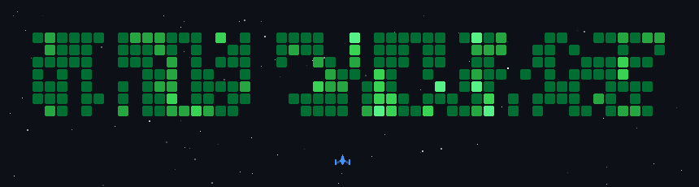

<!-- 

  

 -->

  

I'm a B.Tech CSE student at NIE Mysore, passionate about building efficient and scalable applications. My interests lie in software development, data structures & algorithms, web development, and performance optimization. I enjoy exploring how technology can solve real-life problems, and I’m always eager to learn and improve my craft.

- 🌍 I'm based in Banglore, India
- ✉️ You can contact me at [prajjwal2051@gmail.com](mailto:prajjwal2051@gmail.com)
- 🧠 I'm currently learning Advanced DSA, React, and Backend concepts
- 👥 I'm looking to collaborate on Innovative projects in AI, Web Development, and Open Source
- 💬 Ask me about When I'm not coding, I like exploring geopolitics and tech innovations.

---

### Socials

 <a href="https://www.github.com/Prajjwal2051" target="_blank" rel="noreferrer"> <picture> <source media="(prefers-color-scheme: dark)" srcset="https://raw.githubusercontent.com/danielcranney/readme-generator/main/public/icons/socials/github-dark.svg" /> <source media="(prefers-color-scheme: light)" srcset="https://raw.githubusercontent.com/danielcranney/readme-generator/main/public/icons/socials/github.svg" />  </picture> </a> <a href="https://www.x.com/prajjwal2051__" target="_blank" rel="noreferrer"> <picture> <source media="(prefers-color-scheme: dark)" srcset="https://raw.githubusercontent.com/danielcranney/readme-generator/main/public/icons/socials/twitter-dark.svg" /> <source media="(prefers-color-scheme: light)" srcset="https://raw.githubusercontent.com/danielcranney/readme-generator/main/public/icons/socials/twitter.svg" />  </picture> </a> <a href="https://prajjwalsahuu.hashnode.dev" target="_blank" rel="noreferrer"> <picture> <source media="(prefers-color-scheme: dark)" srcset="https://raw.githubusercontent.com/danielcranney/readme-generator/main/public/icons/socials/hashnode-dark.svg" /> <source media="(prefers-color-scheme: light)" srcset="https://raw.githubusercontent.com/danielcranney/readme-generator/main/public/icons/socials/hashnode.svg" />  </picture> </a> <a href="http://www.medium.com/prajjwal2051" target="_blank" rel="noreferrer"> <picture> <source media="(prefers-color-scheme: dark)" srcset="https://raw.githubusercontent.com/danielcranney/readme-generator/main/public/icons/socials/medium-dark.svg" /> <source media="(prefers-color-scheme: light)" srcset="https://raw.githubusercontent.com/danielcranney/readme-generator/main/public/icons/socials/medium.svg" />  </picture> </a> <a href="https://www.linkedin.com/in/prajjwal-sahu-498620221" target="_blank" rel="noreferrer"> <picture> <source media="(prefers-color-scheme: dark)" srcset="https://raw.githubusercontent.com/danielcranney/readme-generator/main/public/icons/socials/linkedin-dark.svg" /> <source media="(prefers-color-scheme: light)" srcset="https://raw.githubusercontent.com/danielcranney/readme-generator/main/public/icons/socials/linkedin.svg" />  </picture> </a> <a href="https://discord.com/users/prajjwal4966" target="_blank" rel="noreferrer"> <picture> <source media="(prefers-color-scheme: dark)" srcset="https://raw.githubusercontent.com/danielcranney/readme-generator/main/public/icons/socials/discord-dark.svg" /> <source media="(prefers-color-scheme: light)" srcset="https://raw.githubusercontent.com/danielcranney/readme-generator/main/public/icons/socials/discord.svg" />  </picture> </a>

